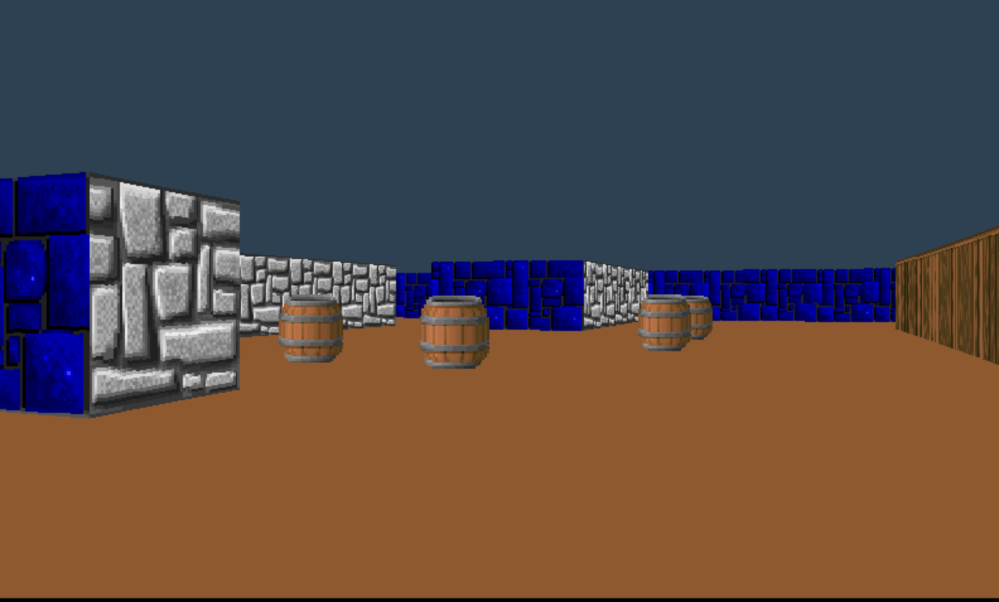

# cub3D_21school

 Реализация псевдо-трехмерного рендера, построенного на принципах рейкастинга.
 
 Проект написан под ```Mac os``` на языке ```Си```, с использованием библиотеки MinilibX
 
 (подробнее про MinilibX: https://harm-smits.github.io/42docs/libs/minilibx.html)

## Cборка проекта

```make``` - компиляция проекта

```./Cub3D.out maps/map.cub``` - запуск проекта, аргументом передается карта с расширением ```.cub```

```make  run``` - компиляция и запуск проекта

```make clean``` - удаление объектных файлов

```make fclean``` - удаление всех скомпилированных файлов

## Управление

Перемещение ```W```, ```A```, ```S```, ```D```.

Поворот камеры - с помощью мыши или стрелок ```<-```, ```->```.

Выход из приложения ```ESC```.


